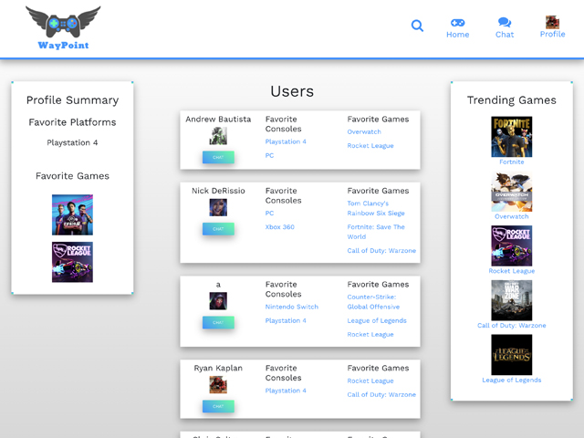

# Waypoint
A social networking platform and instant messenger for gamers to connect with each other.

## User Story
```
AS A user,
I WANT a gaming social network,
SO THAT I can meet and communicate with other gamers who play the same games as myself.
```
## Table of Contents

  * [Waypoint](#waypoint)
  * [User Story](#user-story)
  * [Installation](#installation)
  * [Usage](#Usage)
  * [Motivation](#motivation)
  * [Authors](#authors)
  * [Technologies](#technologies)
  * [Image](#image)
  * [Deployed Application](#deployed-application)

## Installation
To install necessary dependencies, run the following command:

```
npm install
```
## Usage
```
npm run start
```

## Motivation
Waypoint was created as a result of wanting an easier way for gamers to meet other gamers who play the same games on the same consoles. It's diffuclt to find other gamers who are the same level and/or have similar or complimentary playing styles.

Typically gamers can choose to connect with others that they are randomly matched up with by the games. Waypoint is the platform where gamers can meet, plan games, and become friends. 


## Authors
* **Andrew Bautista** - [GitHub](https://github.com/WarriorofZarona)
* **Christopher Soltren** - [GitHub](https://github.com/soltrenc)
* **Nicholas DeRissio** - [GitHub](https://github.com/KantKontrol)
* **Ryan Kaplan** - [GitHub](https://github.com/kapslock07)


## Technologies
<b>Built with</b>
- [REACT](https://reactjs.org/docs/getting-started.html)
- [MySQL](https://dev.mysql.com/doc/)
- [Express](https://nodejs.org/en/docs/)
- [NodeJs](https://nodejs.org/en/docs/)
- [HTML5](https://developer.mozilla.org/en-US/docs/Web/Guide/HTML/HTML5)
- [CSS3](https://developer.mozilla.org/en-US/docs/Web/CSS)
- [Javascript](https://developer.mozilla.org/en-US/docs/Web/JavaScript)
- [MDBoostrap](https://mdbootstrap.com/docs/)  
- [Emotion(CSS Library)]( https://emotion.sh/docs/introduction)
- [React-Spring Animation](https://www.react-spring.io/docs/hooks/basics) 
- [Sequelize](https://sequelize.org/v5/)


## Image


## Deployed Application
<a href="https://ancient-dusk-51587.herokuapp.com/">Waypoint</a>
